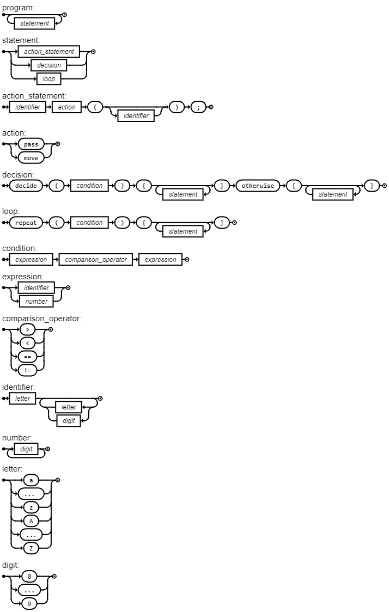

# footlang



ebnf 
```
program = { statement };

statement = action_statement | decision | loop;

action_statement = identifier, action, '(', [ identifier ], ')', ';';
action = 'pass' | 'move';

decision = 'decide', '(', condition, ')', '{', { statement }, '}', 'otherwise', '{', { statement }, '}';

loop = 'repeat', '(', condition, ')', '{', { statement }, '}';

condition = expression, comparison_operator, expression;
expression = identifier | number;
comparison_operator = '>' | '<' | '==' | '!=';

identifier = letter, { letter | digit };
number = digit, { digit };
letter = 'a' |'... '|'z' | 'A' |'...'| 'Z';
digit = '0' | '...' | '9';
```

## Example
```
// Jogador1 passa a bola para Jogador2 se a distância for menor que 10, caso contrário, ele se move.

decide (distance(jogador1, jogador2) < 10) {
    jogador1.pass(jogador2);
} otherwise {
    jogador1.move(newPosition);
}

// Repete a ação de passar enquanto a energia do jogador1 for maior que 50.
repeat (jogador1.energy > 50) {
    jogador1.pass(jogador2);
}
```
