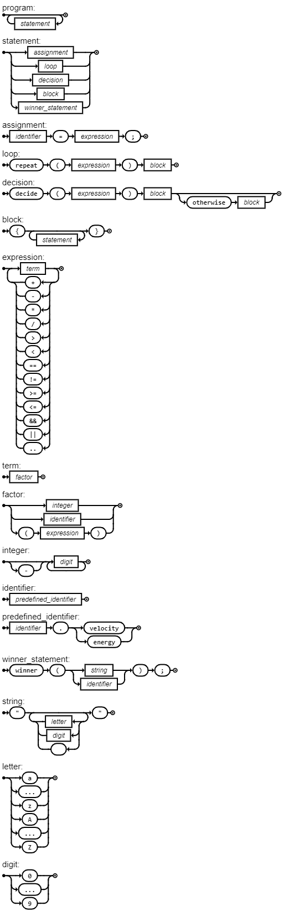

# footlang



ebnf

```
program = { statement };

statement = assignment | loop | decision | block | winner_statement ;

assignment = identifier, "=", expression, ";" ;

loop = "repeat", "(", expression, ")", block ;

decision = "decide", "(", expression, ")", block, ["otherwise", block] ;

block = "{", { statement }, "}" ;

expression = term, { ("+" | "-" | "*" | "/" | ">" | "<" | "==" | "!=" | ">=" | "<=" | "&&" | "||"), term };

term = factor ;

factor = integer
       | identifier
       | "(", expression, ")" ;

integer = [ "-" ], digit, { digit } ;

identifier = predefined_identifier ;

predefined_identifier = identifier, ".", ("velocity" | "energy") ;

winner_statement = "winner", "(", (string | identifier), ")", ";" ;

string = '"', { letter | digit | " " }, '"' ;

letter = "a" | "..." | "z" | "A" | "..." | "Z" ;
digit = "0" | "..." | "9" ;


```

## Example

```
runner1.energy = 100;
runner2.energy = 100;
runner1.velocity = 0;
runner2.velocity = 0;

repeat (runner1.energy > 20 && runner2.energy > 20) {
    runner1.velocity = runner1.velocity + 10;
    runner2.velocity = runner2.velocity + 8;
    runner1.energy = runner1.energy - 15;
    runner2.energy = runner2.energy - 12;

    decide (runner1.velocity > 100) {
        winner("Runner 1 wins!");
    }
    otherwise {
        decide (runner2.velocity > 100) {
            winner("Runner 2 wins!");
        }
    }
}

winner("Race ended!");


```
